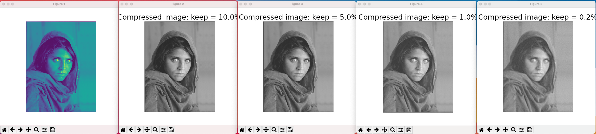
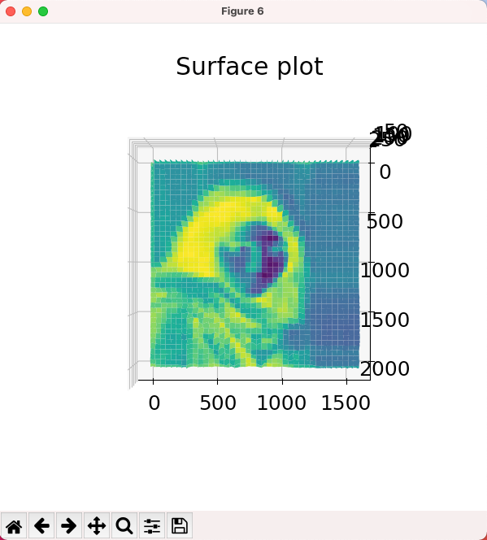
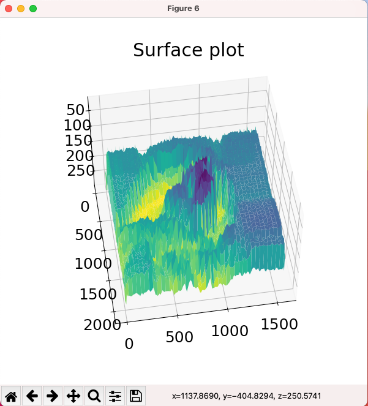
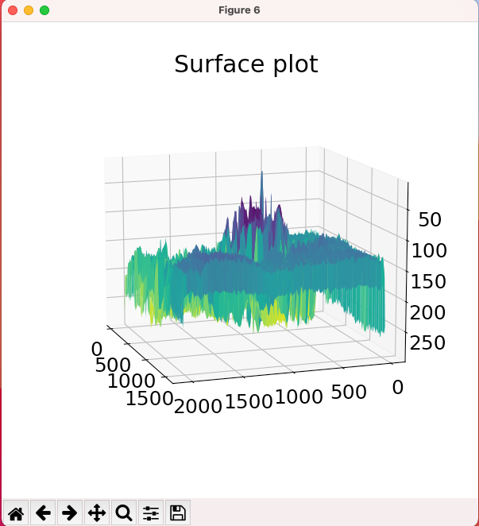

This repository is a result of following Dr. Steve Brunton's lecture on Image Compression and the FFT, and produces a surface plot which helpes me visualize and understand the dimensionality of complex and real domains of an image being compressed.

The 3D surface plot can pivot in the complex and real dimensions and show the unique nature of Fourier waves.

## Compression Ratios by Frequency Eliminations

## Surface Plot View

## Surface Plot View Pivoted in Complex Space

## Surface Plot View Pivoted in Complex Space
